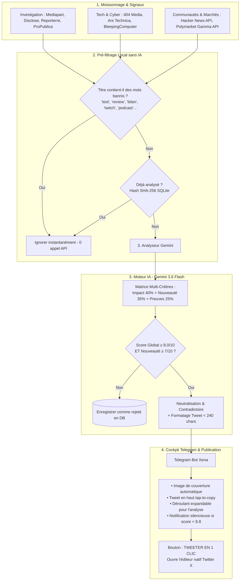

# 🗞️ x-newsletter — Média d'Investigation & Curateur IA Impartial

> **Système autonome de veille d'investigation, déconstruction des biais par IA (Gemini 3.6 Flash) et cockpit de validation éditoriale 1-clic sur Telegram & Twitter/X.**

Hébergé en production 24/7 sur un conteneur dédié Proxmox LXC (Debian 12), ce projet résout un défi majeur de l'information moderne : **extraire le signal pur au milieu du bruit et de la polarisation des réseaux sociaux**, en fournissant à un rédacteur en chef humain des propositions de publications ultra-qualitatives prêtes à être partagées.

---

## 🎯 1. Philosophie & Problématique résolue

### Le Problème sur les Réseaux Sociaux :
1. **L'illusion des flux RSS bruts** : Un bot qui republie des dépêches en continu spamme son audience avec des redites, des tests d'appareils et des micro-faits, perdant toute audience qualifiée.
2. **Le piège du sensationnalisme et du biais** : Même les médias indépendants d'investigation de grande qualité (Mediapart, Disclose, etc.) adoptent des cadrages éditoriaux partisans.
3. **Le coût prohibitif de l'API X (Twitter)** : L'API d'écriture automatisée coûte 100 $/mois avec des risques majeurs de shadowban pour les scripts d'automatisation de navigateur (Playwright).

### La Solution `x-newsletter` :
- **Ingestion sélective** de sources d'investigation réputées, de médias tech d'ingénierie et des signaux probabilistes de **Polymarket**.
- **Pré-filtrage heuristique local (0 €)** : Élimination en amont de tout contenu de type test de gadget, chronique, podcast ou polémique télé.
- **Moteur d'arbitrage IA multi-critères** : Chaque info est soumise à une grille stricte (Impact 40%, Nouveauté 35%, Preuves 25%). Seules les notes $\ge 8.0/10$ sont présentées.
- **Neutralisation chirurgicale du style** : L'IA extrait le fait brut, documente le cadrage de la source d'origine, intègre le contradictoire (la réponse de la partie mise en cause) et rédige un tweet sobre et percutant.
- **Cockpit ergonomique Telegram** : Image de l'article, tweet affiché tout en haut et copiable en 1 tap (`<code>`), analyse approfondie repliée dans un encadré déroulant (`<blockquote expandable>`), et bouton **[TWEETER EN 1 CLIC]** via l'URL d'intention officielle de X.

---

## 🏗️ 2. Architecture Technique



---

## 📐 3. La Matrice d'Évaluation Multi-Critères

L'analyse ne repose pas sur une simple appréciation subjective, mais sur une **note pondérée sur 10** calculée comme suit :

$$\text{Score Global} = (0.40 \times \text{Impact}) + (0.35 \times \text{Nouveauté}) + (0.25 \times \text{Preuves})$$

| Critère | Poids | Description & Exigences | Exemples de notes |
| :--- | :---: | :--- | :--- |
| **Impact Systémique** | **40%** | Portée réelle sur les institutions, les libertés publiques, l'économie mondiale ou les infrastructures tech critiques. | • Test de robot-chien = 1/10<br>• Faille CrowdStrike/Log4j = 9/10<br>• Affaire d'État / Corruption = 9/10 |
| **Nouveauté / Scoop** | **35%** | Caractère exclusif et inédit de l'information (documents fuités, décisions de justice, première publication). | • Bilan annuel / rétrospective = 2/10<br>• Enquête exclusive Disclose = 9/10 |
| **Solidité des Preuves** | **25%** | Présence de pièces matérielles vérifiables (audits, jugements, données on-chain, documents officiels). | • Rumeur anonyme = 3/10<br>• Rapport judiciaire / fuite interne = 9/10 |

### Règle d'éligibilité :
Une information n'est transmise au rédacteur en chef sur Telegram que si :
1. $\text{Score Global} \ge 8.0 / 10$
2. $\text{Nouveauté / Scoop} \ge 7 / 10$

---

## ⚖️ 4. Protocole d'Impartialité Absolue

Pour garantir que le compte X conserve une autorité incontestable :
1. **Épuration lexicale totale** : Interdiction des adjectifs à charge émotionnelle (*"scandaleux"*, *"inquiétant"*, *"révolutionnaire"*, *"inadmissible"*).
2. **Le principe du contradictoire** : Dès qu'une institution ou une personnalité est mise en cause, sa réponse officielle ou la nuance de la défense doit obligatoirement être mentionnée.
3. **Attribution scrupuleuse** : Tout tweet cite explicitement l'origine de l'enquête (*"Selon des documents révélés par Mediapart..."* ou *"D'après les données Polymarket..."*).

---

## 📱 5. Ergonomie des Alertes Telegram (Cockpit Rédacteur)

Chaque alerte reçue par l'éditeur humain sur [@XenaTwitterMediaBot](https://t.me/XenaTwitterMediaBot) est conçue pour une lecture et une décision en **3 secondes chrono** :

```text
┌────────────────────────────────────────────────────────┐
│ [PHOTO DE COUVERTURE AUTOMATIQUE DE L'ENQUÊTE]         │
│                                                        │
│ 🔥 RÉVÉLATION MAJEURE (Score : 8.4/10) • Mediapart     │
│ 📰 Affaire des diurétiques au ministère de la Culture  │
│                                                        │
│ ✍️ Tweet prêt à publier : (tap pour copier)            │
│ ┌────────────────────────────────────────────────────┐ │
│ │ ⚖️ Selon Mediapart, le ministère de la Culture a    │ │
│ │ ignoré pendant dix ans des alertes visant le haut  │ │
│ │ fonctionnaire Christian Nègre, aujourd'hui accusé  │ │
│ │ d'avoir administré des substances à près de 300   │ │
│ │ femmes.                                            │ │
│ │                                                    │ │
│ │ 🔗 https://www.mediapart.fr/journal/...            │ │
│ └────────────────────────────────────────────────────┘ │
│                                                        │
│ ▼ [ENCADRÉ DÉROULANT : CLIQUEZ POUR LIRE L'ANALYSE]   │
│   📊 Notes : Impact 9/10 | Inédit 8/10 | Preuves 8/10  │
│   🔍 Fait brut vérifié : [...]                         │
│   ⚖️ Cadrage & Nuance contradictoire : [...]          │
│                                                        │
│ [ 🐦 VALIDER SUR X (1 CLIC) ]  [ 🔗 LIRE L'ARTICLE ]   │
└────────────────────────────────────────────────────────┘
```

- **Tap-to-Copy** : Le tweet est dans une balise `<code>` Telegram. Un simple tap sur mobile le copie immédiatement.
- **1-Click Tweet** : Le bouton utilise l'URL d'intention `https://twitter.com/intent/tweet?text=...` qui ouvre l'application Twitter native de l'utilisateur avec le tweet pré-saisi. Zéro risque de ban, zéro frais d'API Twitter.
- **Smart Silence** : Notification silencieuse par défaut ; le téléphone ne vibre que pour les séismes majeurs ($\ge 8.8/10$).

---

## 🖥️ 6. Déploiement en Production (Proxmox LXC)

Le bot est déployé dans un conteneur LXC dédié Debian 12 sur Proxmox VE :
* **ID du Conteneur** : `104`
* **Nom d'hôte** : `x-newsletter`
* **RAM allouée** : 1.5 Go (consommation réelle au repos : **~75 Mo**)
* **Stockage** : 15 Go sur `local-lvm`
* **Résolution DNS** : Configuré avec `1.1.1.1` et `8.8.8.8` pour contourner la redirection judiciaire française (ANJ) vers `anj.fr` sur l'API de Polymarket.
* **Service Systemd** : `x-newsletter.service` activé avec redémarrage automatique au boot.

### Gestion du service en CLI :
```bash
# Voir le statut du service
pct exec 104 -- systemctl status x-newsletter

# Suivre les logs en temps réel
pct exec 104 -- journalctl -u x-newsletter -f

# Redémarrer le service
pct exec 104 -- systemctl restart x-newsletter
```

---

## 🛡️ 7. Sécurité & Contrôle Budgétaire des Coûts IA

1. **Compte Gemini en Prépaiement Strict** :
   - Mode prépaiement activé avec solde bloqué.
   - **Recharge automatique DÉSACTIVÉE**.
   - Si le solde tombe à 0,00 €, Google coupe les requêtes : **aucun prélèvement bancaire automatique possible**.
2. **Coût dérisoire de Gemini 3.6 Flash** :
   - 0,075 $ par million de tokens.
   - 5,00 € de crédits = ~70 millions de tokens (~6 mois à 1 an d'autonomie).
3. **Élimination du gaspillage d'appels** :
   - En l'absence de news fraîches, un cycle prend 6 secondes et effectue **0 appel d'API**.
   - Base SQLite avec empreinte SHA-256 pour ne jamais réévaluer un article déjà vu.

---

## 🚀 8. Guide d'Installation Locale & CLI

### Installation des dépendances :
```bash
python3 -m venv venv
source venv/bin/activate
pip install -r requirements.txt
```

### Configuration `.env` :
```ini
GEMINI_API_KEY=votre_cle_google_ai_studio
GEMINI_MODEL=gemini-3.6-flash
TELEGRAM_BOT_TOKEN=token_du_bot
TELEGRAM_CHAT_ID=votre_id_telegram
POLL_INTERVAL_MINUTES=5
DATABASE_PATH=data/x_newsletter.db
```

### Commandes CLI :
```bash
# Vérifier la récupération des sources brutes (sans IA)
python main.py --test-sources

# Exécuter un cycle de test à blanc dans le terminal
python main.py --dry-run

# Exécuter un seul cycle réel
python main.py --once

# Lancer la boucle de veille continue
python main.py
```

---

## 🧪 9. Pistes de Réflexion pour Challenger l'Architecture (Pour IA / Audit Externe)

Si vous soumettez cette architecture à une IA plus avancée ou à un auditeur tech, voici les points de conception stratégiques à challenger :

1. **Déduplication Sémantique vs Hashing SHA-256** :
   - Actuellement, la déduplication repose sur l'URL et le titre normalisé. Faut-il ajouter une couche d'embeddings vectoriels légers (ex: `all-MiniLM-L6-v2` ou embeddings Gemini) pour clusteriser des événements identiques rapportés par plusieurs médias sous des titres différents ?
2. **Débat Multi-Agents pour le Fact-Checking** :
   - Faut-il faire s'affronter deux instances de LLM (un "Procureur" qui cherche les biais d'une enquête et un "Défenseur" qui valide les preuves matérielles) pour stabiliser la note de solidité des preuves ?
3. **Extraction Full-Text vs Résumés RSS** :
   - Actuellement, l'ingestion utilise les résumés enrichis des flux RSS pour préserver la bande passante et le temps d'inférence. Dans quelle mesure le scraping de l'article complet (avec contournement de paywall pour les abonnements) améliorerait-il la détection des preuves chiffrées ?
4. **Scoring des signaux Polymarket** :
   - Quelle formule mathématique optimale utiliser pour corréler le volume en dollars, la volatilité à 24h et la probabilité implicite afin de détecter un vrai retournement prédictif ?
