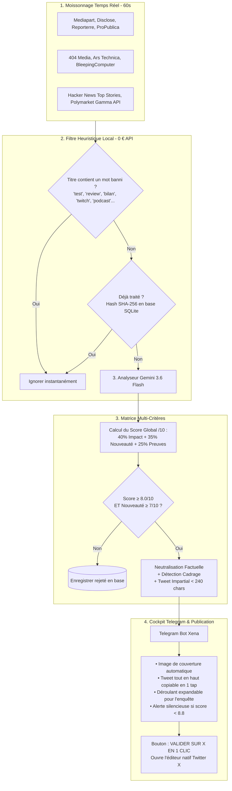

# 🗞️ Xena-Newsletter — Média d'Investigation & Curateur IA en Temps Réel

> **Moteur autonome de veille d'investigation en temps réel, arbitrage IA multi-critères (Gemini 3.6 Flash) et cockpit éditorial 1-clic sur Telegram & Twitter/X.**

Hébergé en production 24/7 sur un conteneur dédié Proxmox LXC (Debian 12), ce projet résout le défi de l'information immédiate : **détecter le signal pur à la seconde où il est publié**, éliminer le bruit sans frais d'API, neutraliser les biais politiques, et fournir à un rédacteur en chef humain des publications prêtes à être partagées en un clic.

---

## ⚡ 1. Pourquoi le "Temps Réel Intelligent" (Cadence 60s + ETag) ?

Dans le journalisme d'actualité, une information exclusive perd 80% de sa valeur de partage après 30 minutes. Cependant, interroger des serveurs d'information en continu sans pause entraîne un blocage immédiat de l'adresse IP par les pare-feux (Cloudflare / WAF 429 Too Many Requests).

### L'Architecture Temps Réel Implémentée :
- **Fréquence ultra-rapide (60 secondes)** : Dès qu'une enquête, un 0-day cyber ou un retournement Polymarket est mis en ligne, il est capté en **moins d'une minute**.
- **Mise en cache conditionnelle HTTP 304 (`ETag` / `If-Modified-Since`)** :
  - Le bot envoie l'empreinte ETag du dernier passage.
  - Si le média n'a rien publié de nouveau, le serveur web distant renvoie un code `HTTP 304 Not Modified` (0 octet transféré, exécution en 10 millisecondes, zéro risque de bannissement IP).
- **Zéro appel API en l'absence de scoop** : L'API Gemini n'est sollicitée **que** si une nouvelle dépêche passe le filtre local anti-bruit.

---

## 🏗️ 2. Pipeline de Traitement des Dépêches



---

## 📐 3. La Matrice d'Évaluation Multi-Critères

L'analyse ne repose pas sur une simple appréciation subjective, mais sur une **note pondérée sur 10** calculée mathématiquement :

$$\text{Score Global} = (0.40 \times \text{Impact}) + (0.35 \times \text{Nouveauté}) + (0.25 \times \text{Preuves})$$

| Critère | Poids | Définition & Exigences | Exemples de calibration |
| :--- | :---: | :--- | :--- |
| **Impact Systémique** | **40%** | Portée réelle sur les institutions, les libertés publiques, l'économie mondiale ou les infrastructures tech critiques. | • Test de gadget personnel = 1/10<br>• Faille CrowdStrike/Log4j mondiale = 9/10<br>• Révélation d'affaire d'État = 9/10 |
| **Nouveauté / Scoop** | **35%** | Caractère exclusif et inédit de l'information (documents fuités, décisions judiciaires, publication d'enquête originale). | • Bilan annuel / rétrospective = 2/10<br>• Enquête exclusive Disclose = 9/10 |
| **Solidité des Preuves** | **25%** | Présence de pièces matérielles vérifiables (audits, jugements, données on-chain, documents officiels). | • Rumeur anonyme sans document = 3/10<br>• Rapport judiciaire / fuite interne = 9/10 |

### Règle d'éligibilité :
Une information n'est transmise sur Telegram que si :
1. $\text{Score Global} \ge 8.0 / 10$
2. $\text{Nouveauté / Scoop} \ge 7 / 10$

---

## ⚖️ 4. Protocole d'Impartialité & Neutralisation

Pour garantir que le compte X conserve une autorité et une crédibilité incontestables :
1. **Épuration lexicale totale** : Bannissement absolu des adjectifs à charge émotionnelle (*"scandaleux"*, *"inquiétant"*, *"révolutionnaire"*, *"inadmissible"*). Uniquement des faits mesurables et des verbes d'action.
2. **Le principe du contradictoire** : Dès qu'une institution ou une personnalité est mise en cause, sa réponse officielle ou la nuance de la défense doit obligatoirement être résumée.
3. **Attribution scrupuleuse** : Tout tweet cite explicitement l'origine de l'enquête (*"Selon des documents révélés par Mediapart..."* ou *"D'après les données Polymarket..."*).

---

## 📱 5. Ergonomie des Alertes Telegram (Cockpit Rédacteur)

Chaque alerte reçue par l'éditeur humain sur [@XenaTwitterMediaBot](https://t.me/XenaTwitterMediaBot) est conçue pour une lecture et une décision en **3 secondes chrono** :

```text
┌────────────────────────────────────────────────────────┐
│ [PHOTO DE COUVERTURE OFFICIELLE DE L'ARTICLE]          │
│                                                        │
│ 🔥 RÉVÉLATION MAJEURE (Score : 8.4/10) • Mediapart     │
│ 📰 Affaire des diurétiques au ministère de la Culture  │
│                                                        │
│ ✍️ Tweet prêt à publier : (tap pour copier)            │
│ ┌────────────────────────────────────────────────────┐ │
│ │ ⚖️ Selon Mediapart, le ministère de la Culture a    │ │
│ │ ignoré pendant dix ans des alertes visant le haut  │ │
│ │ fonctionnaire Christian Nègre, aujourd'hui accusé  │ │
│ │ d'avoir administré des substances à près de 300   │ │
│ │ femmes.                                            │ │
│ │                                                    │ │
│ │ 🔗 https://www.mediapart.fr/journal/...            │ │
│ └────────────────────────────────────────────────────┘ │
│                                                        │
│ ▼ [ENCADRÉ DÉROULANT : TAPEZ POUR LIRE L'ANALYSE]      │
│   📊 Notes : Impact 9/10 | Inédit 8/10 | Preuves 8/10  │
│   🔍 Fait brut vérifié : [...]                         │
│   ⚖️ Cadrage & Nuance contradictoire : [...]          │
│                                                        │
│ [ 🐦 VALIDER SUR X (1 CLIC) ]  [ 🔗 LIRE L'ARTICLE ]   │
└────────────────────────────────────────────────────────┘
```

- **Tweet tout en haut & Tap-to-Copy** : Le tweet est placé en haut dans une balise `<code>` Telegram. Un simple tap du doigt le copie dans le presse-papier.
- **Détails repliés par défaut** : L'enquête complète, les notes et le cadrage sont dans un `<blockquote expandable>` interactif.
- **1-Click Tweet** : Bouton direct vers `https://twitter.com/intent/tweet?text=...` qui ouvre l'application Twitter avec le texte pré-rempli (zéro risque de ban, zéro coût d'API Twitter).
- **Notifications Silencieuses Intelligentes** : Le téléphone ne vibre que pour les événements majeurs ($\ge 8.8/10$).

---

## 🖥️ 6. Déploiement en Production (Proxmox LXC)

Le système tourne 24/7 dans un conteneur LXC dédié Debian 12 :
* **Conteneur** : CT `104` (`x-newsletter`)
* **Consommation** : ~58 Mo de RAM
* **Résolution DNS** : `1.1.1.1` et `8.8.8.8` pour contourner la redirection judiciaire française (ANJ) vers `anj.fr` sur l'API de Polymarket.
* **Service Systemd** : `x-newsletter.service` avec autorestart.

### Commandes utiles :
```bash
# Vérifier le statut du service
pct exec 104 -- systemctl status x-newsletter

# Suivre les logs temps réel
pct exec 104 -- journalctl -u x-newsletter -f

# Redémarrer
pct exec 104 -- systemctl restart x-newsletter
```

---

## 🛡️ 7. Sécurité & Contrôle Budgétaire de l'API

1. **Compte Gemini en Prépaiement Strict** :
   - Mode prépaiement activé avec solde bloqué.
   - **Recharge automatique DÉSACTIVÉE**.
   - Dès que le solde atteint 0,00 €, Google coupe les requêtes : **aucun prélèvement bancaire automatique possible**.
2. **Coût ultra-faible de Gemini 3.6 Flash** :
   - 0,075 $ par million de tokens (~70 millions de tokens pour 5 € de crédits).
   - En l'absence de scoop, les cycles HTTP 304 consomment **0 appel API**.

---

## 🧪 8. Pistes pour Challenger l'Architecture (Audit IA / Expert)

Si vous soumettez cette architecture à une IA plus avancée ou à un auditeur tech :

1. **Déduplication Sémantique vs Hashing SHA-256** :
   - Faut-il ajouter une couche d'embeddings vectoriels légers (ex: `all-MiniLM-L6-v2`) pour regrouper sous un même fil plusieurs médias traitant du même événement avec des titres différents ?
2. **Débat Multi-Agents pour le Fact-Checking** :
   - Faut-il faire s'affronter deux instances d'agents (un "Procureur" traquant les biais et un "Défenseur" validant les preuves matérielles) pour stabiliser la note de solidité des preuves ?
3. **Scoring Prédictif Polymarket** :
   - Quelle fonction mathématique est la plus pertinente pour détecter une anomalie de marché : vélocité du prix ($\Delta p / \Delta t$) ou ratio volume/liquidité ?
