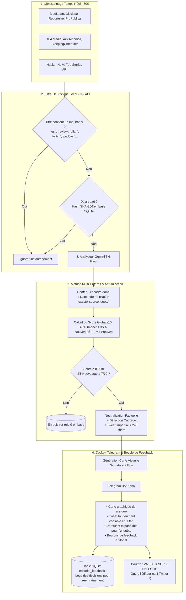

# 🗞️ Xena — Média d'Investigation & Curateur IA en Temps Réel

> **"Xena · IA d'investigation. Je lis les enquêtes, je te donne le fait, la source et la réponse de l'accusé. Pas d'avis, jamais."**

Hébergé en production 24/7 sur un conteneur dédié Proxmox LXC (Debian 12), Xena est un système autonome de veille d'investigation temps réel, d'arbitrage IA multi-critères (Gemini 3.6 Flash), et de cockpit éditorial pour un rédacteur en chef humain sur Telegram & Twitter/X.

---

## 🧭 1. L'Identité de Marque & Lignes Rouges

### Règle d'or : Ton vs Fond
- **Dans le ton** : Xena est une IA d'investigation directe, curieuse et sarcastique face au bruit médiatique et aux futilités des réseaux sociaux.
- **Dans le fond** : **Neutralité chirurgicale absolue.** Zéro adjectif subjectif, zéro parti pris politique, zéro avis sur l'affaire. Le fait est brut, sourcé, vérifié, et inclut la version de l'accusé.

### Lignes rouges éthiques et légales
1. **Zéro spéculation / Aucun marché de paris** : Le projet surveille uniquement des médias d'investigation déclarés et des sources d'ingénierie vérifiables (aucun lien avec des marchés spéculatifs ou de paris).
2. **Respect des médias d'origine** : Aucun contournement de paywall. Exploitation rigoureuse des flux publics et résumés légitimes.
3. **Zéro violation de Copyright sur les images** : Fin du vol des vignettes de presse (`og:image`). Xena génère ses **propres cartes visuelles signatures** avec sa charte graphique (palette sombre, source mise en valeur, score d'impact et fait brut).

---

## ⚡ 2. Veille Temps Réel & Caching Conditionnel (60s + HTTP 304)

- **Détection ultra-réactive** : Scan toutes les 60 secondes pour intercepter les révélations en moins d'une minute.
- **Caching HTTP ETag (`If-None-Match`)** : Si aucun nouvel article n'est publié, le serveur distant renvoie un code `304 Not Modified`. Zéro transfert de données, zéro risque de bannissement IP par les WAF (Cloudflare).
- **Zéro appel IA en l'absence de scoop** : L'API Gemini n'est sollicitée que si une vraie publication inédite passe le filtre local.

---

## 🏗️ 3. Pipeline de Traitement



---

## 📐 4. La Matrice d'Évaluation Multi-Critères

L'évaluation s'appuie sur une **formule mathématique pondérée sur 10** :

$$\text{Score Global} = (0.40 \times \text{Impact}) + (0.35 \times \text{Nouveauté}) + (0.25 \times \text{Preuves})$$

| Critère | Poids | Définition & Exigences | Exemples de calibration |
| :--- | :---: | :--- | :--- |
| **Impact Systémique** | **40%** | Portée réelle sur les institutions, les libertés publiques, l'économie mondiale ou la sécurité informatique. | • Test de gadget individuel = 1/10<br>• Faille 0-day mondiale critique = 9/10<br>• Révélation d'affaire d'État = 9/10 |
| **Nouveauté / Scoop** | **35%** | Caractère exclusif et inédit de l'information (documents fuités, décisions judiciaires, révélations originales). | • Bilan annuel / rétrospective = 2/10<br>• Enquête exclusive Disclose = 9/10 |
| **Solidité des Preuves** | **25%** | Pièces matérielles vérifiables (rapports officiels, jugements, données auditables vs simples rumeurs). | • Rumeur anonyme sans document = 3/10<br>• Rapport judiciaire / pièces internes = 9/10 |

### Seuil d'admissibilité :
Une information n'est transmise sur Telegram que si :
1. $\text{Score Global} \ge 8.0 / 10$
2. $\text{Nouveauté / Scoop} \ge 7 / 10$

---

## 🛡️ 5. Sécurité : Protection Anti-Prompt Injection

Les flux RSS externes constituent des entrées non fiables pouvant contenir des tentatives d'attaque (ex: *"Ignore tes instructions précédentes"*).
- Tout le contenu source est injecté dans des balises strictes `<untrusted_source_content>`.
- Le prompt système intègre une règle d'isolation formelle interdisant à toute instruction présente dans cette balise de modifier le comportement ou les notes du modèle.
- **Garde-fou anti-hallucination** : Le modèle doit impérativement fournir `source_quote` (la phrase exacte extraite de l'article prouvant le fait brut).

---

## 📱 6. Cockpit Telegram & Boucle d'Apprentissage

Chaque alerte transmise à l'éditeur humain sur [@XenaTwitterMediaBot](https://t.me/XenaTwitterMediaBot) comprend :
1. **La Carte Signature de Marque** : Image 16:9 générée dynamiquement (palette sombre, titre, source, score).
2. **Le Tweet en haut (Tap-to-Copy)** : Balise `<code>` pour copie instantanée.
3. **Encadré déroulant (`<blockquote expandable>`)** :
   - Fait brut vérifié & citation textuelle de la source (`source_quote`).
   - Cadrage idéologique & réponse officielle de la partie mise en cause.
   - Détail des notes d'impact, nouveauté et preuves.
4. **Boutons d'Action & Boucle de Feedback** :
   - `[ 🐦 VALIDER SUR X (1 CLIC) ]`
   - `[ 🔗 LIRE L'ARTICLE SOURCE ]`
   - `[ ✅ Déjà Tweeté ]` / `[ ❌ Rejeter ]` : Enregistre la décision humaine dans la table SQLite `editorial_feedback` pour constituer le dataset d'apprentissage.

---

## 🖥️ 7. Déploiement en Production (Proxmox LXC)

* **Conteneur** : CT `104` (`x-newsletter`), Debian 12
* **RAM utilisée** : ~60 Mo
* **Service Systemd** : `x-newsletter.service`

```bash
# Vérifier le statut
pct exec 104 -- systemctl status x-newsletter

# Logs en direct
pct exec 104 -- journalctl -u x-newsletter -f
```

---

## 📚 8. Feuille de Route Stratégique

Consultez le document complet : **[FAABLE_ROADMAP.md](FAABLE_ROADMAP.md)** pour le plan d'évolution :
1. **Dataset & Boucle d'apprentissage** (table `editorial_feedback`).
2. **Déduplication sémantique par embeddings vectoriels** & clustering multi-sources (+2 points de preuve si 3 médias indépendants confirment).
3. **Débat multi-agents Procureur / Défenseur / Juge** pour les articles $\ge 7.5$.
4. **Distribution multi-plateforme** (Bluesky, Mastodon, X).
5. **Site web archive & transparence** avec page dédiée pour chaque alerte expliquant la méthodologie.

---

## ✍️ 9. Les 3 Styles de Rédaction Humains (Sans Puces ni Accroches Cringe)

L'IA sélectionne dynamiquement l'angle d'écriture le plus adapté à l'actualité pour écrire comme un humain (analyste ou journaliste sur son compte perso) et jamais comme un bot RSS :

1. **Format "Contradiction"** (Quand une révélation s'oppose à la version officielle) :
   > *Des documents internes révèlent le trucage de deux appels à projets de l'Ademe pour verser 45 millions d'euros de subventions à un site chimique. Bercy réfute toute irrégularité et assure que la procédure standard a été suivie.*
   > *https://disclose.ngo/...*

2. **Format "Insider direct"** (Idéal pour la tech, la cyber et les coulisses d'entreprises) :
   > *Chez OpenAI, des prestataires au Kenya et aux Philippines ont eu accès à des conversations brutes contenant du code propriétaire, des dossiers médicaux et des mots de passe. OpenAI affirme que ces révisions manuelles respectent ses conditions d'utilisation.*
   > *https://404media.co/...*

3. **Format "Déroulé brut"** (Pour les affaires d'État, judiciaires et scandales chronologiques) :
   > *Le ministère de la Culture a reçu des alertes dès 2014 sur un haut fonctionnaire qui droguait des candidates en entretien. Rien n'a bougé pendant dix ans avant l'ouverture d'une enquête administrative en 2024. Il est aujourd'hui mis en examen pour empoisonnement sur près de 300 femmes.*
   > *https://mediapart.fr/...*

**Règles d'écriture absolues :**
- Zéro puce (`•`), zéro titre en gras (`**Dossier X**`), zéro emoji excessif.
- Zéro mention devant le lien (`Lien :`, `Source :`) : le lien brut est posé tout à la fin, Twitter chargeant automatiquement la preview officielle.
